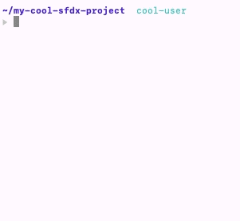

<h1 align="center">avit-sfdx</h1>

Custom theme for oh-my-zsh that expands on the default provided theme avit to add the configured `defaultusername` for `sfdx` in the prompt.

### Prerequisites

* [oh-my-zsh](https://github.com/ohmyzsh/ohmyzsh)
* [jq](https://github.com/stedolan/jq)

### Installation

Simply copy the `avit-sfdx.zsh-theme` file into your custom themes folder (`~/.oh-my-zsh/custom/themes/`), and update your `~/.zshrc` to use it by setting the variable `ZSH_THEME="avit-sfdx"`. Restart your terminal and happy Salesforce coding!